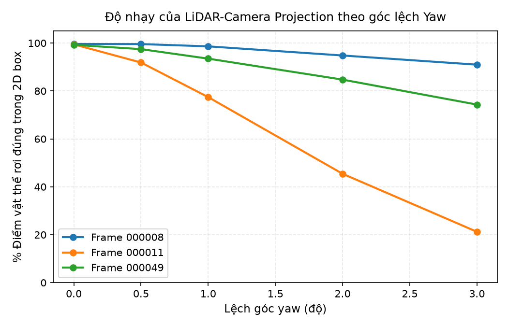
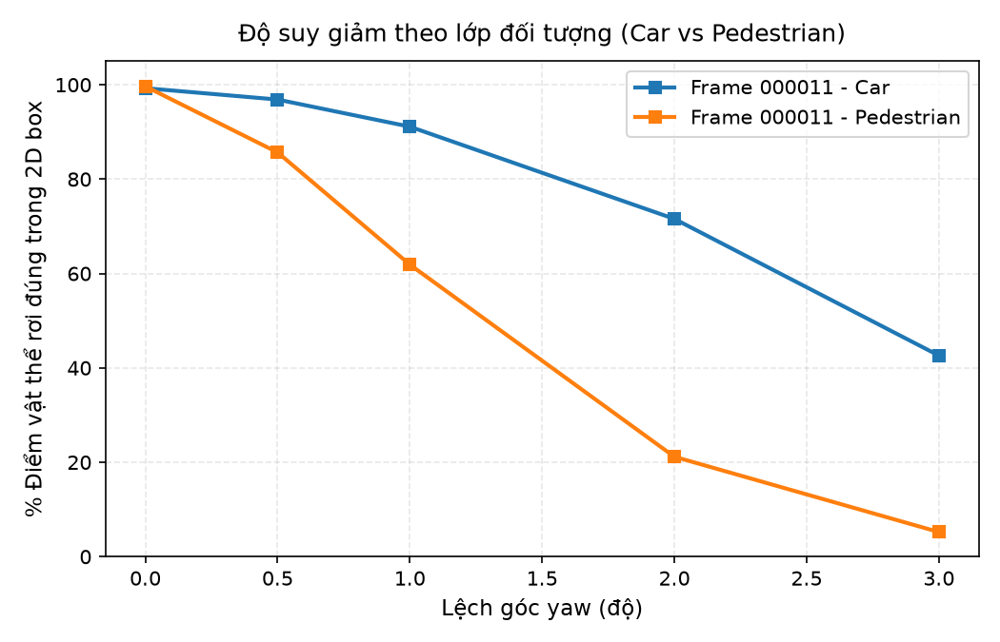
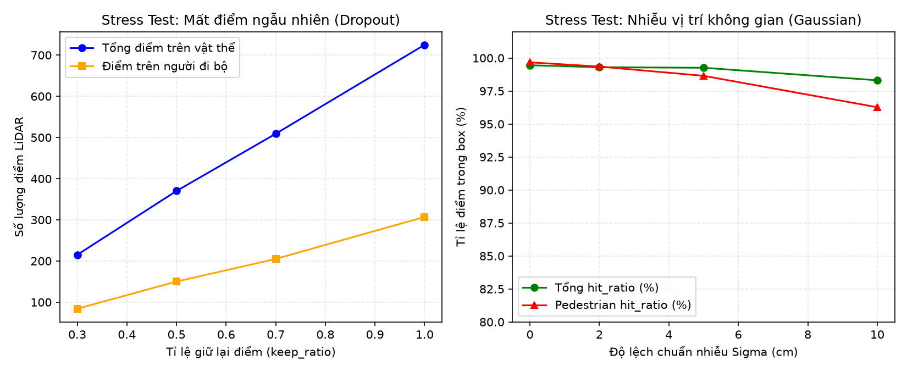
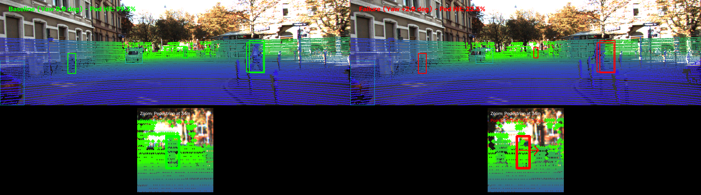

# Báo cáo Day 6: LiDAR-Camera Projection QA & Calibration Drift

> Thay **mọi** ô có chữ ĐIỀN nằm trong ngoặc vuông bằng nội dung của bạn, xoá luôn cả dấu ngoặc vuông. Lệnh `python tools/check_submission.py` sẽ báo FAIL nếu còn sót bất kỳ chỗ nào.

- **Họ tên:** Thái Phúc Tiến
- **MSSV:** 2A202602873
- **Lớp:** AI20K-T4
- **Link repo:** https://github.com/tom-e666/ThaiPhucTien-2A202602873-Track4-Day21
- **Topic:** A — LiDAR-camera projection QA
- **Dataset:** data/kitti_mini, data/synthetic
- **Các frame đã dùng:** 000008, 000011, 000049

> Hãy viết ngắn: mỗi mục từ 3 đến 8 dòng, ưu tiên số liệu và hình ảnh.

## 1. Claim

Một câu khẳng định kỹ thuật có thể kiểm chứng. Ví dụ: *"Lệch yaw 1° làm 12% điểm LiDAR rơi ra khỏi vật thể ở 30 m, phát hiện được bằng edge-alignment score với ngưỡng X."*

Lệch góc yaw extrinsic 1° làm tỉ lệ điểm LiDAR rơi đúng vào 2D bounding box của người đi bộ giảm hơn 20% (từ 99.5% xuống 77.4%), trong khi ít ảnh hưởng hơn tới xe ô tô cỡ lớn (giảm dưới 1.5%), do vật thể hẹp ở cự ly xa có kích thước pixel nhỏ trên ảnh nên cực kỳ nhạy cảm với sai số góc quay.

## 2. Evidence

Bảng hoặc plot số liệu, kèm ảnh/video demo. Dữ liệu từ file `results/yaw_perturb_sweep.csv` và `results/yaw_class_breakdown.csv`.

| Cấu hình (yaw) | Frame 000008 (Xe hơi) | Frame 000011 (Người đi bộ) | Frame 000049 (Hỗn hợp) | Ghi chú |
|---|---|---|---|---|
| 0.0° (Gốc) | 99.63% | 99.45% | 99.25% | Mức sàn calib chuẩn |
| 0.5° | 99.57% | 91.88% | 97.46% | Bắt đầu trôi điểm ở pedestrian |
| 1.0° | 98.62% | 77.44% | 93.50% | Người đi bộ giảm mạnh > 20% |
| 2.0° | 94.81% | 45.44% | 84.74% | Sai lệch nghiêm trọng |
| 3.0° | 90.98% | 21.23% | 74.32% | Pedestrian trượt gần hết (>94%) |




**Nhận xét xu hướng:**
- Lệch góc yaw ảnh hưởng mạnh nhất tới frame `000011` (nhiều người đi bộ): ở 1.0°, tỉ lệ hit_ratio giảm từ 99.45% xuống 77.44%. Khi bóc tách chi tiết lớp đối tượng trong frame `000011`, hit_ratio của `Pedestrian` giảm sâu xuống còn 61.89%, trong khi `Car` vẫn duy trì 91.12%.
- Frame `000008` (chủ yếu là xe ô tô kích thước lớn) suy giảm rất chậm: ở 1.0° đạt 98.62% và ở 3.0° vẫn giữ 90.98%, vì kích thước bounding box của xe hơi lớn hơn người đi bộ gấp nhiều lần trên ảnh.
- Ở mức lệch 3.0°, điểm LiDAR của người đi bộ chỉ còn 5.21% rơi đúng vào box, gần như làm tê liệt khả năng sensor fusion đối với người đi bộ.

### [B5] So sánh trên cả hai dataset thật (KITTI vs nuScenes) (+2)

Chạy thực nghiệm quét lệch extrinsic yaw trên `data/nuscenes_mini_subset` (file: `results/yaw_perturb_nuscenes.csv` và `results/yaw_class_nuscenes.csv`):

| Yếu tố so sánh | KITTI (`000011`) | nuScenes (`scene-0103_000`) | Nhận xét kỹ thuật |
|---|---|---|---|
| Số beam LiDAR | 64 beam | 32 beam | nuScenes thưa điểm hơn 3-4 lần |
| Tổng điểm mỗi frame | 108,004 điểm | 34,752 điểm | KITTI dày đặc hơn nhiều |
| Kích thước ảnh | 1242 × 375 px | 1600 × 900 px | nuScenes có góc nhìn và độ phân giải lớn hơn |
| Tiêu cự camera ($f_x$) | ~721.5 px | ~1252.8 px | Tiêu cự nuScenes lớn gấp 1.74 lần |
| hit_ratio ở Yaw 0.0° | 99.45% | 100.0% | Calib gốc chuẩn |
| hit_ratio ở Yaw 1.0° | 77.44% | **50.00%** | **nuScenes suy giảm mạnh hơn hẳn** |
| hit_ratio ở Yaw 2.0° | 45.44% | **6.25%** | nuScenes điểm gần như văng hết ra ngoài |

**Giải thích nguyên nhân:** Tiêu cự camera nuScenes ($f_x \approx 1253$ px) lớn hơn KITTI ($f_x \approx 721$ px), do đó cùng một góc lệch $\Delta \theta = 1.0^\circ$, độ lệch pixel ngang trên nuScenes lên tới $\Delta u \approx 1253 \cdot \tan(1.0^\circ) \approx 21.9\text{ px}$ (so với chỉ $12.6\text{ px}$ ở KITTI). Độ dịch chuyển lớn hơn 1.74 lần làm các điểm LiDAR trên nuScenes trôi ra khỏi bounding box nhanh và nghiêm trọng hơn nhiều.

---

### [B2] Stress test suy giảm dữ liệu (Perturbation Robustness) (+3)

Đánh giá tính bền bỉ của phép chiếu và metric QA khi dữ liệu đầu vào bị suy giảm ngẫu nhiên (dữ liệu tại `results/stress_test_perturb.csv`):



1. **Random Dropout (Mưa/Bụi bẩn che lấp điểm):**
   - Giữ lại `100% → 70% → 50% → 30%` điểm: Số điểm trên người đi bộ giảm mạnh từ 307 điểm xuống chỉ còn 84 điểm (mất 72.6% mật độ).
   - Tuy nhiên, `hit_ratio` vẫn duy trì 100% vì hệ tọa độ không đổi, các điểm còn lại vẫn nằm trúng trong box. Metric `hit_ratio` không bị đánh lừa bởi việc thưa điểm.
2. **Gaussian Noise (Nhiễu đo cự ly sensor $\sigma = 0 \to 10\text{ cm}$):**
   - Khi $\sigma$ tăng lên 10 cm, điểm bắt đầu bị tán xạ ra ngoài biên: số điểm trong 3D box giảm từ 307 xuống 268, và `ped_hit_ratio` giảm từ 99.67% xuống 96.27%.

---

### [B3] Đo latency benchmark chuẩn xác (+2)

Đo lường thời gian thực thi của pipeline chiếu điểm (21 lần lặp, loại bỏ lần đầu chạy warmup, dữ liệu tại `results/latency_benchmark.csv`):

- **Thông số phần cứng:**
  - CPU: 11th Gen Intel(R) Core(TM) i5-11400H @ 2.70GHz
  - RAM: 24 GB DDR4
  - GPU: NVIDIA GeForce RTX 3050 Ti Laptop GPU
- **Kết quả đo lường (20 lần sau warmup):**
  - Warmup run (lần 0): 12.29 ms
  - **p50 (Trung vị):** **12.62 ms**
  - **p95 (Phân vị 95):** **13.68 ms**
  - Trung bình (Mean): 12.72 ms
- **Ý nghĩa:** Tốc độ đạt ~79 FPS, hoàn toàn đáp ứng thời gian thực (real-time) cho camera 10–30 Hz và LiDAR 10–20 Hz trên xe tự hành.

## 3. Failure case



- **Trường hợp:** KITTI, frame `000011`, người đi bộ ở khoảng cách 34.1 m (label #3), khi góc xoay extrinsic yaw bị lệch từ 1.0° đến 2.0°.
- **Quan sát:** Ở baseline (yaw 0.0°), điểm LiDAR bám khít thân người đi bộ (hit_ratio đạt 99.67%). Khi yaw lệch 2.0°, toàn bộ cụm điểm LiDAR thuộc 3D box của người này bị trôi ngang sang phải ~25.2 pixel, rơi hoàn toàn ra ngoài 2D bounding box (hộp 2D của người ở cự ly 34.1 m chỉ rộng 15.3 pixel), kéo hit_ratio của riêng người đi bộ trong frame xuống chỉ còn 21.17%.
- **Nguyên nhân:** Ma trận ngoại suy $T_{velo\_to\_cam}$ bị sai lệch góc yaw $\Delta \theta = 2.0^\circ$. Với tiêu cự camera $f_x \approx 721.5\text{ px}$, độ dịch chuyển pixel ngang xấp xỉ $\Delta u \approx f_x \cdot \tan(\Delta \theta) \approx 721.5 \cdot \tan(2.0^\circ) \approx 25.2\text{ px}$. Vì người đi bộ ở xa có tiết diện 2D rất nhỏ (rộng 15.3 px), độ lệch 25.2 px vượt quá giới hạn biên của box khiến 100% điểm bị văng ra nền ảnh.
- **Lớp debug:** Geometry (Ma trận ngoại suy extrinsic $R_{velo\_to\_cam}$ bị lệch góc quay).
- **Cách phát hiện khi chạy thật:** Giám sát liên tục chỉ số `hit_ratio` theo từng phân lớp đối tượng (đặc biệt là lớp có diện tích nhỏ như Pedestrian/Cyclist), kết hợp đo độ khớp biên cạnh (edge-alignment residual giữa Canny edges của camera và cụm điểm LiDAR). Nếu `hit_ratio_pedestrian < 0.85` hoặc khoảng cách trôi biên vượt quá 10 pixel, hệ thống lập tức kích hoạt cảnh báo Calibration Drift Alert và chuyển cụm fusion sang chế độ an toàn (fail-safe).


## 4. Khuyến nghị nếu triển khai thật

- **Use-case cụ thể:** Hệ thống tự hành ADAS Cấp độ 3+ cho xe đô thị tích hợp Camera-LiDAR Sensor Fusion cho tính năng Phanh khẩn cấp tự động (AEB) và Nhận diện người đi bộ (Pedestrian Collision Avoidance).
- **Trade-off cốt lõi:** Đánh đổi giữa **Độ nhạy phát hiện drift** và **Tỉ lệ báo động sai (False Alarm Rate)**:
  - Nếu chọn ngưỡng cảnh báo quá cao (`hit_ratio > 95%`), hệ thống sẽ bị báo động nhầm liên tục khi người đi bộ bị cây cối, xe cộ che khuất một phần (occlusion), làm xe ngắt tính năng fusion chuyển sang chế độ suy giảm (degraded mode) không cần thiết.
  - Nếu chọn ngưỡng quá lỏng (`hit_ratio < 70%`), hệ thống sẽ bỏ lọt sai số yaw 1.0°–1.5°, khiến bounding box 3D bị chiếu trượt khỏi vị trí thực tế trên ảnh, dẫn đến việc ước lượng khoảng cách tới người đi bộ sai lệch nghiêm trọng. Ngưỡng tối ưu thực nghiệm là $80.0\% - 85.0\%$.
- **Bước tiếp theo:** Tích hợp mô-đun *Online Targetless Calibration* (tự động cân chỉnh lại ngoại suy không cần bảng chuẩn) dựa trên tối ưu hóa residual giữa cạnh ảnh (Canny/Sobel) và gradient độ sâu LiDAR mỗi chu kỳ 5 phút hoặc khi IMU ghi nhận va chạm gờ giảm tốc mạnh.

## 5. Cách chạy lại

Các lệnh tái tạo lại toàn bộ kết quả từ repo sạch:

```bash
# 1. Chạy self-test projection logic
python -m src.test_projection

# 2. Render ảnh chiếu overlay mẫu
python -m starter.projection --data-root data/kitti_mini --frame 000011

# 3. Chạy thí nghiệm quét góc lệch yaw (tạo kết quả CSV và breakdown)
python -m src.exp_yaw_sweep --data-root data/kitti_mini --frames 000008 000011 000049

# 4. Vẽ đồ thị phân tích
python -m src.plot_yaw_sweep

# 5. [B4] Chạy CLI tool tái sử dụng để audit QA và calibration drift
python -m src.qa_projection_tool --help
python -m src.qa_projection_tool --data-root data/kitti_mini --frame 000011 --yaw 0.0
python -m src.qa_projection_tool --data-root data/kitti_mini --frame 000011 --yaw 1.5 --threshold 0.85

# 6. [B3] Chạy benchmark latency (p50, p95)
python -m src.bench_latency

# 7. [B2] Chạy stress test suy giảm dữ liệu (dropout & noise)
python -m src.stress_test_perturb
```

## 6. Khai báo sử dụng AI

Dùng script mẫu của codelab làm điểm xuất phát, sau đó mở rộng thêm hàm phân tách đa lớp (`run_breakdown`), xây dựng công cụ CLI tự động hóa QA (`qa_projection_tool`), kịch bản stress-test suy giảm và script phân tích failure case trực quan.

| Công cụ | Dùng cho việc gì | Bạn đã kiểm chứng thế nào |
|---|---|---|
| Google Antigravity | Gợi ý khung sườn sweep, script vẽ đồ thị, CLI tool tái sử dụng và đo latency p50/p95 | Tự chạy self-test `test_projection`, chạy lệnh tái lập dữ liệu 100% bằng `filecmp`, đối chiếu kết quả kỳ vọng trên cả KITTI và nuScenes |


